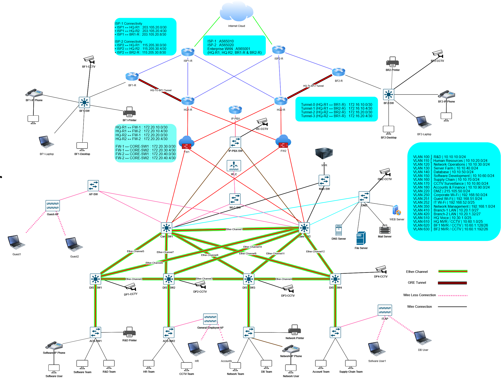

# Enterprise Multi-Site Network Infrastructure

A production-inspired Cisco Packet Tracer project that demonstrates the design and implementation of a highly available, scalable, and resilient enterprise network connecting a Headquarters (HQ) with two geographically distributed branch offices.

The project focuses on enterprise routing, switching, WAN connectivity, high availability, VLAN segmentation, centralized network services, and wireless infrastructure using Cisco enterprise technologies. Cisco ASA firewalls are included as part of the overall enterprise architecture.

---

## Network Topology

<p align="center">
  
</p>

---

# Project Overview

The objective of this project was to design and implement a production-inspired enterprise network that reflects the architecture commonly used in modern corporate environments.

The Headquarters (HQ) serves as the central hub, hosting enterprise services such as DNS, DHCP, Web, Mail, File Server, IP-PBX, Wireless LAN Controller (WLC), CCTV, and NVR. Two branch offices are connected to the HQ through redundant ISP links and GRE tunnels, ensuring reliable communication between all sites.

To improve availability and resiliency, the network incorporates OSPF, eBGP, GRE tunnels, HSRP, VLAN segmentation, Inter-VLAN routing, Layer 3 switching, and EtherChannel. These technologies work together to provide dynamic routing, gateway redundancy, link redundancy, and fault tolerance.

Cisco ASA firewalls are included in the topology as part of the enterprise design. However, advanced firewall policy implementation was intentionally kept outside the primary scope of this project to place greater emphasis on routing, switching, WAN connectivity, redundancy, and centralized services.

---

# Enterprise Architecture

- Headquarters (HQ)
- Branch Office 1
- Branch Office 2
- Three-Tier Campus Architecture
- Core Layer
- Distribution Layer
- Access Layer
- Dual ISP Connectivity
- Dual Cisco ASA Firewalls
- Dedicated DMZ
- Server Farm
- Enterprise Wireless Infrastructure
- Enterprise Voice Network
- CCTV & NVR Infrastructure

---

# Key Features

## High Availability

- HSRP Gateway Redundancy
- HSRP Preemption
- HSRP Priority
- Interface Tracking
- Dual Core Switch Architecture
- Dual ISP Connectivity
- EtherChannel (LACP)

## WAN Infrastructure

- Redundant ISP Connectivity
- GRE Site-to-Site Tunnels
- Multiple Tunnel Interfaces
- eBGP WAN Routing
- WAN Redundancy

## Routing

- OSPF Area 0
- OSPF MD5 Authentication
- Dynamic Route Advertisement
- Inter-VLAN Routing
- Layer 3 Switching

## Switching

- VLAN Segmentation
- IEEE 802.1Q Trunking
- EtherChannel (LACP)
- PVST+
- STP Root Priority
- PortFast
- Native VLAN

## Security

- Cisco ASA Firewall Integration
- Basic ACL Configuration
- Basic NAT Configuration
- Dedicated DMZ
- OSPF MD5 Authentication
- Enterprise Network Segmentation

## Enterprise Services

- DHCP Server
- DNS Server
- Web Server
- Mail Server
- File Server
- DHCP Relay (IP Helper)
- Wireless LAN Controller (WLC)
- Corporate Wi-Fi
- Guest Wi-Fi
- Cisco IP-PBX
- VoIP
- CCTV
- Network Video Recorder (NVR)

---

# VLAN Plan

| VLAN | Network | Purpose |
|------|---------|----------|
|100|10.10.10.0/24|Department Network|
|110|10.10.20.0/24|Department Network|
|120|10.10.30.0/24|Department Network|
|130|10.10.40.0/24|Department Network|
|140|10.10.50.0/24|Department Network|
|150|10.10.60.0/24|Department Network|
|160|10.10.70.0/24|Department Network|
|170|10.10.80.0/24|Department Network|
|180|10.10.90.0/24|Department Network|
|220|215.105.50.0/24|DMZ|
|250|192.168.50.0/24|Corporate Wi-Fi|
|251|192.168.51.0/24|Guest Wi-Fi|
|252|192.168.52.0/25|IT Wireless|
|350|192.168.1.0/24|Management|
|410|10.20.1.0/27|Branch Office 1 LAN|
|420|10.20.1.32/27|Branch Office 2 LAN|
|510|10.30.1.0/25|HQ Voice|
|520|10.30.1.128/26|Branch Office 1 Voice|
|530|10.30.1.192/26|Branch Office 2 Voice|
|610|10.60.1.0/25|HQ CCTV|

---

# Technologies Used

| Category | Technologies |
|----------|--------------|
| Routing | OSPF, eBGP, GRE Tunnel |
| High Availability | HSRP, Interface Tracking |
| Switching | VLAN, Inter-VLAN Routing, Layer 3 Switching, EtherChannel (LACP), PVST+, STP |
| Security | Cisco ASA (Basic Integration), ACL, NAT, DMZ |
| Wireless | Wireless LAN Controller (WLC), Corporate WLAN, Guest WLAN |
| Network Services | DHCP, DNS, Web, Mail, File Server |
| Voice | Cisco IP-PBX, VoIP |
| Monitoring | CCTV, NVR |
| Platform | Cisco IOS, Cisco Packet Tracer |

---

# Enterprise Services

The Headquarters hosts centralized enterprise services that are shared across all branch locations.

- DNS Server
- DHCP Server
- Web Server
- Mail Server
- File Server
- Wireless LAN Controller (WLC)
- Cisco IP-PBX
- CCTV
- Network Video Recorder (NVR)

---

# Skills Demonstrated

This project provided practical experience in:

- Enterprise Network Design
- Campus Network Architecture
- Routing & Switching
- Dynamic Routing (OSPF & eBGP)
- GRE Tunnel Deployment
- High Availability using HSRP
- Layer 3 Switching
- VLAN Planning & Segmentation
- EtherChannel (LACP)
- Enterprise Wireless Deployment
- Cisco ASA Firewall Integration
- Enterprise Network Services
- VoIP Infrastructure
- Network Troubleshooting
- Infrastructure Documentation

---

# Repository Structure

```text
Enterprise-Multi-Site-Network/
│
├── configs/
├── diagrams/
├── documentation/
├── packet-tracer/
├── screenshots/
├── README.md
└── LICENSE
```

---

# Project Verification

The deployment was verified using Cisco IOS commands and end-to-end connectivity testing.

### Routing

```bash
show ip route
show ip protocols
show ip interface brief
```

### OSPF

```bash
show ip ospf neighbor
show ip ospf interface brief
show ip route ospf
```

### BGP

```bash
show ip bgp summary
```

### HSRP

```bash
show standby
show standby brief
```

### Switching

```bash
show vlan brief
show interfaces trunk
show etherchannel summary
show spanning-tree
```

### Connectivity

```bash
ping
traceroute
```

---

# Future Enhancements

- Advanced Cisco ASA Security Policies
- IPsec Site-to-Site VPN
- AAA (RADIUS/TACACS+)
- SNMP Monitoring
- Syslog Server
- QoS for Voice Traffic
- IPv6 Deployment
- Network Automation using Python & Ansible

---

# About This Project

This project was developed as part of my hands-on learning journey in enterprise networking. The goal was to design and implement a realistic multi-site enterprise infrastructure while applying industry-standard networking technologies and best practices.

The project emphasizes redundancy, scalability, centralized services, and resilient routing to simulate a production-inspired enterprise environment.

---

# Author

**Md. Delowar Hossain**

**Network Engineer**  
Walton Hi-Tech Industries PLC

📧 **Email:** delowar21997@gmail.com

---

## License

This project is licensed under the MIT License. See the **LICENSE** file for details.
